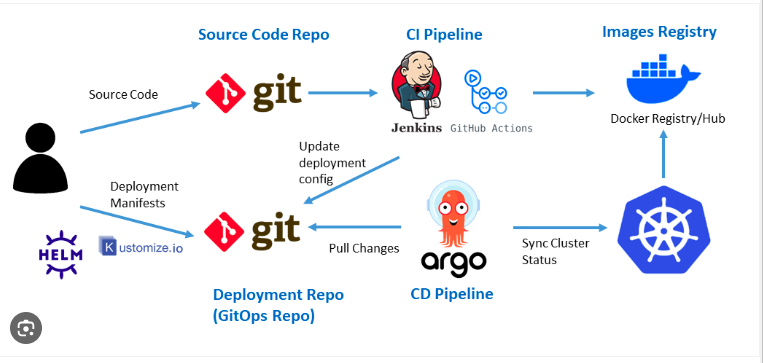

# CI/CD Lab with Jenkins and ArgoCD

Este laboratorio te guiará a través de la configuración de un pipeline CI/CD que automatiza el despliegue de una aplicación Node.js utilizando **Jenkins** y **ArgoCD**, aplicando principios GitOps. Trabajarás con dos repositorios: uno para el código de la aplicación y otro para el **Helm chart** que gestiona los despliegues en Kubernetes.

## Tabla de Contenidos

- [Descripción del Flujo CI/CD](#descripción-del-flujo-cicd)
- [Repositorios](#repositorios)
- [Instrucciones del Laboratorio](#instrucciones-del-laboratorio)
  - [1. Forkea Ambos Repositorios](#1-forkea-ambos-repositorios)
  - [2. Crear un Dockerfile](#2-crear-un-dockerfile)
  - [3. Crear el Pipeline en Jenkins](#3-crear-el-pipeline-en-jenkins)
  - [4. Configurar ArgoCD](#4-configurar-argocd)
  - [5. Actualizar la Aplicación para Desplegar](#5-actualizar-la-aplicación-para-desplegar)
- [Resultado Final](#resultado-final)
- [Enlaces Útiles](#enlaces-útiles)

---

## Descripción del Flujo CI/CD



### 1. **Gestión de Código en GitHub**

- Los desarrolladores realizan cambios en el repositorio de código fuente de la **aplicación Node.js**.
- Jenkins es notificado (webhook o polling) cuando se detectan cambios.

### 2. **Pipeline CI en Jenkins**

- Jenkins hace build de la aplicación y crea una imagen Docker.
- La imagen Docker es subida a un registro de contenedores (Docker Hub, ECR, etc.).
- Jenkins actualiza el repositorio **GitOps** (Helm chart) con la nueva etiqueta de la imagen Docker.
- Jenkins hace commit de estos cambios en el repositorio GitOps.

### 3. **Monitoreo y Sincronización con ArgoCD**

- **ArgoCD** monitorea el repositorio GitOps y detecta cuando se realizan cambios.
- ArgoCD sincroniza los cambios con el clúster de Kubernetes, desplegando la nueva versión de la aplicación.

### 4. **Despliegue en Kubernetes**

- Kubernetes aplica los cambios y realiza un **rolling update**, reemplazando gradualmente los pods antiguos con los nuevos.
- Si hay algún problema, ArgoCD o el administrador pueden hacer un rollback a una versión anterior usando GitOps.

---

## Repositorios

- **Node.js Application**: [nodejs-app-aroldev](https://github.com/arol-dev/nodejs-app-aroldev)
- **Helm Chart (Infrastructure)**: [nodejs-app-aroldev-infra](https://github.com/arol-dev/nodejs-app-aroldev-infra)

Forkea ambos repositorios a tu cuenta de GitHub antes de empezar el laboratorio.

---

## Instrucciones del Laboratorio

### 1. Forkea Ambos Repositorios

1. Ve a GitHub y haz un fork de estos repositorios:

   - Node.js Application (Este mismo repo): https://github.com/arol-dev/nodejs-app-aroldev
   - Helm Chart (Infrastructure): https://github.com/arol-dev/nodejs-app-aroldev-infra

2. Clona tus forks localmente:
   ```bash
   git clone https://github.com/<tu-usuario>/nodejs-app-aroldev.git
   git clone https://github.com/<tu-usuario>/nodejs-app-aroldev-infra.git
   ```

### 2. Crear un Dockerfile

1. En tu fork del repositorio de la aplicación Node.js, crea un archivo `Dockerfile` para construir la imagen Docker de la aplicación.

### 3. Crear el Pipeline en Jenkins

1. Accede a Jenkins: https://jenkins.aroldev.com/. Con el usuario `admin` y el password que compartiremos en discord.

2. Crea un nuevo pipeline en Jenkins llamado `<numero-sala>-ci` para tu fork del repositorio de la aplicación.

3. Habilita un sondeo de dos minutos: `H/2 * * * *`

4. El pipeline tiene que ejecutar los siguentes pasos:

   - Git clone del Node.js Application: https://github.com/arol-dev/nodejs-app-aroldev
   - Jenkins construye la aplicación y crea una imagen Docker.
   - La imagen Docker es subida a un registro de contenedores Docker Hub. Utiliza las credentailes con id `dockerhub`
   - Jenkins actualiza el repositorio **GitOps** (Helm chart) con la nueva etiqueta de la imagen Docker. Actualiza el campo `deployemnt.image.tag` nel archivo values. yaml.
     - Helm Chart (Infrastructure): https://github.com/arol-dev/nodejs-app-aroldev-infra
   - Jenkins hace commit de estos cambios y un push en el repositorio GitOps.

Template Jenkinsfile para crear los varios pasos:

```groovy
   pipeline {
    agent { label 'docker-agent'}
    stages {
        stage('Git Clone') {
            steps {
                script {
                    sh "echo \"The Build Number is ${env.BUILD_NUMBER}\""
                }
            }
        }

        stage('Check Docker socket') {
            steps {
                container('docker') {
                    sh """
                    sleep 3
                    docker version
                    """
                }
            }
        }

        stage('Build Docker image') {
            steps {
                container('docker') {
                    sh """

                    """
                }
            }
        }

        stage('Login to DockerHub') {
            steps {
                container('docker') {

                }
            }
        }

        stage('Push Docker Image') {
            steps {
                container('docker') {
                    sh """

                    """
                }
            }
        }

        stage('Clean Workspace') {
            steps {
                cleanWs()
            }
        }

        stage('Update values.yaml Chart') {
            steps {
                script {
                    // Update the image tag in values.yaml (assumes image: <tag> format)
                    sh """

                    """
                }
            }
        }

        stage('Git Push Infra') {
            steps {
                withCredentials([
                    gitUsernamePassword(credentialsId: 'github', gitToolName: 'Default')
                ]) {
                    sh """

                    """
                }
            }
        }
    }

    post {
        always {
            echo 'Cleaning workspace...'
            cleanWs()  // This is the step to clean the workspace
        }
    }
}
```

### 4. Configurar ArgoCD

1. Accede a **ArgoCD**: [ArgoCD Dashboard](https://argo.aroldev.com/). Credentiales: Username: admin, password que compartiremos en discord.
2. Crea una nueva aplicación en **ArgoCD** apuntando a tu fork del repositorio Helm Chart:

   - **Destino del Repositorio**: URL de tu fork del repositorio `nodejs-app-aroldev-infra`.
   - **Ruta del Helm chart**: `charts/nodejs-app`.
   - **Sync Policy**: Automática o manual según prefieras.

3. Verifica que ArgoCD pueda sincronizar correctamente los cambios con tu clúster de Kubernetes.

### 5. Actualizar la Aplicación para Desplegar

1. Realiza cambios en tu aplicación (por ejemplo, cambia el mensaje de bienvenida nel fichero README.md).
2. Haz un **push** de estos cambios a tu fork del repositorio de la aplicación.
3. Observa cómo el pipeline CI/CD se dispara automáticamente:

   - Jenkins detecta el cambio, construye la nueva imagen Docker y actualiza el repositorio de infraestructura.
   - ArgoCD detecta el nuevo commit y despliega la nueva versión de la aplicación en Kubernetes.

---

## Resultado Final

Al finalizar el laboratorio, habrás creado un pipeline CI/CD completo donde:

1. Los cambios en el código fuente de la aplicación activan automáticamente Jenkins. Por ejemplo, haz un cambio en el html que sea visible en la aplicación. Haz commit y push.
2. Observa como Jenkins construye una nueva imagen Docker, la sube al registro de contenedores y actualiza el manifiesto en el repositorio GitOps.
3. ArgoCD sincroniza los cambios con Kubernetes y despliega la nueva versión de la aplicación en el clúster.
4. Accede a la aplicación en tu navegador con la IP del cluster (preguntad por discord) y el puerto asignado al NodePort de vuestra aplicación (consultad en argo, por el nodeport creado).

---

## Enlaces Útiles

- **Jenkins**: [https://jenkins.aroldev.com/](https://jenkins.aroldev.com/)
- **ArgoCD**: [https://argo.aroldev.com/](https://argo.aroldev.com/login?return_url=https%3A%2F%2Fargo.aroldev.com%2Fapplications)
- **Repositorio Node.js App**: [https://github.com/aroldev/nodejs-app-aroldev](https://github.com/arol-dev/nodejs-app-aroldev)
- **Repositorio Helm Chart**: [https://github.com/aroldev/nodejs-app-aroldev-infra](https://github.com/arol-dev/nodejs-app-aroldev-infra)

---

¡Buena suerte en tu laboratorio de CI/CD! 🐙
